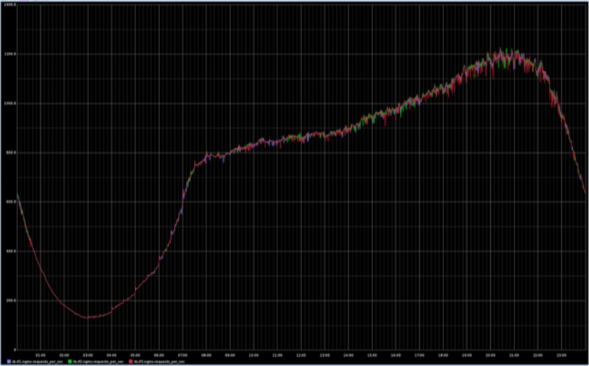

# tech-highload-hw2
## Тема
Приложение для групповых видеозвонков.
Пользователь может:  
- войти, зарегистрироваться
- начать, закончить видеозвонок
- просоединиться к видеозвонку, покинуть его
## Нагрузка
Будем исходить из того, что в сервисе максимально 2 411 895 активных пользователей в день. Каждый пользователь поучаствовал в среднем в 4 звонках. Будем считать, что звонок в среднем идёт 1 час и имеет 4 участников. Получаем в сутки примерно 2 411 895 звонков. С учётом распределения суточной нагрузки, согласно графику ниже, — 168 170 одновременно идущих звонков максимально. Для получения этого значения я оценил среднее значение RPS за каждый час, сложил их, поделил на 24 — это среднее значение за сутки. Поделив 2 411 895 на отношение этого значения к максимальному значению RPS за сутки, я получил 168 170.

## Логическая схема базы данных
Нужно хранить сессии авторизации, данные о пользователях, данные об активных звонках.

Сессия
| Название | Тип  | Размер  |
| -------- | ---- | ------- |
| sessinID | uuid | 16 байт |
| userID   | int  | 8 байт  |

Пользователи
| Название | Тип         | Размер  |
| -------- | ----------- | ------- |
| id       | int         | 8 байт  |
| логин    | string      | 20 байт |
| пароль   | string      | 30 байт |
| email    | string      | 30 байт |
| имя      | string      | 30 байт |

Звонки
| Название  | Тип        | Размер          |
| --------- | ---------- | --------------- |
| id        | uuid       | 16 байт         |
| участники | array[int] | 8 байт — ∞ байт |
## Физическая система хранения
### СУБД
Все данные храним в Tarantool.

Для сессии авторизации Tarantool подходит, потому что он быстрее Redis. [\[1\]][1] [\[2\]][2] [\[3\]][3]

Для холодных данные о пользователях используем Vinyl — движок Tarantool для хранения данных на диске. [\[4\]][4] [\[5\]][5]

Данные об активных звонках нужно быстро создавать, быстро удалять, быстро выдавать, и живут они недолго. Однозначно Tarantool.
### Расчёт нагрузки
Если считать, что пользователь разлогинивается после каждого звонка и заходит в приложение только ради них, получается средняя нагрузка на хранилище сессий — `2 411 895 пользователей × 4 раза в сутки / 24 часа / 3600 секунд = 111 RPS`, пиковая — `111 RPS × (2 411 895 / 168 170) = 1529 RPS`.

Пусть пользователи авторизуются в половине случаев открытия приложения. Тогда данные о пользователе нужны при каждой проверке пароля и при каждом входе в звонок. Итого в среднем `2 411 895 пользователей × 4 раза в сутки × 1,5 (1 — вероятность запроса на подключение к звонку, 0,5 — вероятность запроса данных для авторизации) / 24 часа / 3600 секунд = 167 RPS`, максимально — `167 RPS × (2 411 895 / 168 170) = 2402 RPS`.

Для одного звонка в среднем требуется 8 операций: создание звонка, 4 присоединения к нему, 2 отсоединения, удаление звонка. Отсюда на хранилище звонков средняя нагрузка — `8 × 2 411 895 / 24 / 3600 = 223 RPS`, максимальная — `223 RPS × (2 411 895 / 168 170) = 3 203 RPS`.

Для Tarantool это не нагрузка.
## Прочие технологии
Бэкенд на Go. Состоит из двух независимых частей: сервиса авторизации и сервиса звонков. Сервис звонков разбит на три микросервиса: микросервис загрузки видео/аудио, микросервис перекодировки видео, микросервис раздачи видео/аудио. Протокол общения между фронтендом и сервисом авторизации — HTTP.

Для обеспечения нормального общения большого количества (> 4) человек задействуем сервер-хост. Общение с ним происходит по протоколу UDP. Сервер будет принимать видео и аудио от каждого участника. Далее есть две опции: если участник сейчас в состоянии принять HD видео и аудио, ему отправляются необработанные буферы всех участников; если же не в состоянии, то сервер раскодирует принятые буферы, перекодирует в SD и отправит.

Также для оптимизации использования сети можно не получать и/или не отдавать звук, если он ниже определённого порога или если микрофон выключен; отдавать видео в качестве пропорциональном размеру его картинки на экране, т.е. если видео пользователя развёрнуто на весь экран (например, он сейчас говорит) отдаём его по логике из предыдущего абзаца, если же пользователь показан небольшим окошком в списке участников, понижаем качество его видео.

Для аудио будем использовать кодек Opus: он универсален в плане вида аудио (моно/стерео и т.п.) и имеет хорошее отношение качество/степень сжатия. Что наиболее важно: Opus имеет минимальную задержку при кодировании — от 2,5 мс до 60 мс. [\[6\]][6]  
Для видео — H.264. Он быстрее конкурентов, поддерживается на 99% устройств, менее требователен к батарее, имеет лучшее качество видео после кодирования и раскодирования и, что немаловажно, очень высокую степень сжатия. [\[7\]][7] [\[8\]][8]
## Расчет нагрузки и потребного оборудования
### Объём данных
Одна запись пользователя занимает 118 байт. Будем считать, что пользователей в базе 7 074 225. Итого `796 Мбайт` данных о пользователях.

Суммарный объём хранилища сессий за сутки: `2 411 895 × 4 × 0,5 (другая половина сессий протухла) × 24 байт = 110 Мб`. Максимальный: `168 170 × 4 × 2,5 (помимо участников текущих звонков ещё некоторое количество залогиненых пользователей) × 24 байт = 38,5 Мбайт`.

Суммарный объём хранилища звонков за сутки: `2 411 895 × (16 байт + 4 × 8 байт) = 110 Мбайт`. Максимальный — `168 170 × (16 байт + 4 × 8 байт) = 7,7 Мбайт`.
### RPS
Для получения и передачи видео и аудио сервис принимает в среднем `2 411 895 пользователей × 4 звонка × 8 запросов (2 на получение + 6 в среднем на передачу) / 24 часа / 3600 секунд = 893 RPS`. Максимально — `893 RPS × (2 411 895 / 168 170) = 12 811 RPS`.  
Авторизации, подлючения к звонкам, отлючения от звонков, создание и удаление звонков создают ещё `((2 411 895 пользователей × 2 (авторизация только в половине случаев)) + (2 411 895 звонков × 4 подключения) + (2 411 895 звонков × 2 отключения) + 2 411 895 созданий + 2 411 895 удалений) / 24 / 3600 = 279 RPS` в среднем, `279 RPS × (2 411 895 / 168 170) = 4003 RPS` максимально.
### Трафик
#### Видео
Будем считать, что каждый человек в среднем использует видео 60% времени, проводимого в звонках.  
Для получения видео от (2 411 895 × 4) участников звонков (по часу и по 4 человека в среднем) потребуется `b × 3600 секунд × 2 411 895 × 4 × 0,6` трафика в сутки  
Для передачи видео (2 411 895 × 4) участников звонков остальным участникам звонка (по часу и по 4 человека в среднем) потребуется `b × 3600 секунд × 2 411 895 × 4 × 0,6 × 3` трафика в сутки  
Где `b` — битрейт видео.

Битрейт видео, закодированного в H.264 (глубина цвета — 3 байта) [\[9\]][9]
|             | 24 fps         | 60 fps         |
| ----------- | -------------- | -------------- |
| 320 × 240   | 169,62 Кбайт/с | 424,05 Кбайт/с |
| 426 × 240   | 225,81 Кбайт/с | 564,52 Кбайт/с |
| 640 × 360   | 508,86 Кбайт/с | 1,27 Мбайт/с   |
| 854 × 480   | 905,34 Кбайт/с | 2,26 Мбайт/с   |
| 1280 × 720  | 2,04 Мбайт/с   | 5,09 Мбайт/с   |
| 1920 × 1080 | 4,58 Мбайт/с   | 11,45 Мбайт/с  |

То есть в идеале (1920×1080@60) получаем `11,45 Мбайт/с × 3600 секунд × 2 411 895 × 4 × 0,6 × 4 = 891,5 Пбайт` трафика в сутки. `891,5 Пбайт / 24 / 3600 = 10,5 Тбайт/c` в среднем, `10,5 Тбайт/с × (2 411 895 / 168 170) = 151,5 Тбайт/с` максмально.  
Фактически идеал недостижим и самым распространённым разрешением веб-камеры являяется VGA 640×480 с 4-битным цветом [\[10\]][10]. За среденее разрешение фронтальной камеры смартфона возьмём 1920×1080. Будем считать количество запросов с десктопов и смартфонов равными. Частоту кадров и для тех, и для тех примем 24 fps. Тогда получаем `(113,08 Кбайт/с × 3600 секунд × 2 411 895 × 2 × 0,6 × 4) + (4,58 Мбайт/с × 3600 секунд × 2 411 895 × 2 × 0,6 × 4) = 4,3 Пбайт + 177,7 Пбайт = 182 Пбайт` трафика в сутки. `182 Пбайт / 24 / 3600 = 2,16 Тбайт/с` в среднем, `2,16 Тбайт/с × (2 411 895 / 168 170) = 30,95 Тбайт/с` максимально.
Также учтём оптимизацию, понижающую качество видео пропорционально размеру на экране. Допустим, есть один говорящий + ещё 3 в списке участников. Их изображение будет 320×240. Тогда получаем для десктопов:  
`113,08 Кбайт/с × 3600 секунд × 2 411 895 × 2 × 0,6 = 1097,3 Тбайт` на получение  
`113,08 Кбайт/с × 3600 секунд × 2 411 895 × 2 × 0,6 × 3 × 0,25 = 822,98 Тбайт` на передачу в изначальном качестве с вероятностью 0,25  
`28,27 Кбайт/с × 3600 секунд × 2 411 895 × 2 × 0,6 × 3 × 0,75 = 617,24 Тбайт` на передачу в пониженом качестве с вероятностью 0,75  
Итого `1097,3 Тбайт + 822,98 Тбайт + 617,24 Тбайт = 2537,52 Тбайт = 2,5 Пбайт`  
Для смартфонов:  
`4,58 Мбайт/с × 3600 секунд × 2 411 895 × 2 × 0,6 = 44,44 Пбайт` на получение  
`4,58 Мбайт/с × 3600 секунд × 2 411 895 × 2 × 0,6 × 3 × 0,25 = 33,33 Пбайт` на передачу в изначальном качестве с вероятностью 0,25  
`169,62 Кбайт/с × 3600 секунд × 2 411 895 × 2 × 0,6 × 3 × 0,75 = 1,8 Пбайт` на передачу в пониженом качестве с вероятностью 0,75  
Итого `44,44 Пбайт + 33,33 Пбайт + 1,8 Пбайт = 79,58 Пбайт`  

В сумме для обеих платформ `82,08 Пбайт` трафика в сутки: `45,51 Пбайт` входящего и `36,54 Пбайт` исходящего.  
`82,06 Пбайт / 24 / 3600 = 996,15 Гбайт/с` в среднем: `45,51 Пбайт / 24 / 3600 = 522,32 Гбайт/с` входящего и `36,54 Пбайт / 24 / 3600 = 443,46 Гбайт/с` исходящего.  
`996,15 Гбайт/с × (2 411 895 / 168 170) = 13,95 Тбайт/с` максимально: `522,32 Гбайт/с × (2 411 895 / 168 170) = 7,32 Тбайт/с` входящего и `443,46 Гбайт/с × (2 411 895 / 168 170) = 6,21 Тбайт/с` исходящего.
#### Аудио
Будем считать, что каждый человек в среднем использует аудио 10% времени, проводимого в звонках.  
Для получения аудио от (2 411 895 × 4) участников звонков (по часу и по 4 человека в среднем) потребуется `b × 3600 секунд × (2 411 895 × 4) × 0,1` трафика в сутки  
Для передачи аудио (2 411 895 × 4) участников звонков остальным участникам звонка (по часу и по 4 человека в среднем) потребуется `b × 3600 секунд × (2 411 895 × 4) × 0,1 × 3` трафика в сутки  
Где `b` — битрейт аудио.

Битрейт аудио, закодированного в Opus [\[11\]][11]
| узкополосное кодирование | широкополосное кодирование | полное кодирование | полное кодирование стерео |
| ------------------------ | -------------------------- | ------------------ | ------------------------- |
| 10 Кбит/с                | 16 Кбит/с                  | 40 Кбит/с          | 128 Кбит/с                |

То есть в идеале (128 Кбит/с) получаем `128 Кбит/с × 3600 секунд × (2 411 895 × 4) × 0,1 × 4 = 207,6 Тбайт` трафика в сутки, `207,6 Тбайт / 24 / 3600 = 2,46 Гбайт/c` в среднем, `2,46 Гбайт/с × (2 411 895 / 168 170) = 35,3 Гбайт/с` максмально.  
Фактически, скорее всего, в основном будет доступно и достаточно широкополосное кодирование (16 Кбит/с). `16 Кбит/с × 3600 секунд × (2 411 895 × 4) × 0,1 × 4 = 25,88 Тбайт` трафика в сутки: `6,47 Тбайт` входящего, `19,41 Тбайт` исходящего.  
`25,88 Тбайт / 24 / 3600 = 314 Мбайт/c` в среднем: `78,5 Мбайт/с` входящего, `235,5 Мбайт/с` исходящего.  
`314 Мбайт/с × (2 411 895 / 168 170) = 4,4 Гбайт/с` максмально: `1,1 Гбайт/с` входящего, `3,3 Гбайт/с` исходящего.
#### Остальное
Если взять 512 Кбайт за средний размер HTTP запроса, получим `279 RPS × 512 Кбайт × 2 = 279 Мбайт/c` в среднем, `4003 RPS × 512 Кбайт × 2 = 3,9 Гбайт/с` максимум.
#### Итого
`996,15 Гбайт/c + 314 Мбайт/c + 279 Мбайт/с = 996,73 Гбайт/с` в среднем, из них `522,32 Гбайт/с + 78,5 Мбайт/с + 139,5 Мбайт/с = 522,53 Гбайт/с` входящий трафик, `443,46 Гбайт/с + 235,5 Мбайт/с + 139,5 Мбайт/с = 443,83 Гбайт/с` — исходящий.  
`13,95 Тбайт/с + 4,4 Гбайт/с + 3,9 Гбайт/с = 13,96 Тбайт/с` максимум, из них `7,32 Тбайт/с + 1,1 Гбайт/с + 1,95 Гбайт/с = 7,32 Тбайт/с` входящий трафик, `6,21 Тбайт/с + 3,3 Гбайт/с + 1,95 Гбайт/с = 6,22 Тбайт/с` — исходящий.
### CPU
#### Кодирование видео
По данным [бенчмарка x264][benchmark] медианное количество кадров в секунду, обрабатываемых про кодировании видео 1920×1080 в H.264, составляет 75, среднее — 139, максимальное — 217. Получается, на среднем процессоре при хорошей конфигурации системы кодирование одной секунды видео 1920×1080@60 займёт 0,43 с, на лучшем при хорошей конфигурации системы — 0,27 с. Кодировать нужно в основном 320×240@24, иногда 854×480@24. Отмасштабировав значения для 1 секунды 320×240@24, получим 6,4 мс и 4,01 мс на среднем и лучшем процессоре соответственно.

Стоит отметить, что по данным бенчмарка сложно судить о производительности кодировании на одном потоке того или иного процессора, так как неизвестно, как распределялась нагрузка между ними и не редки случаи, когда процессоры с меньшим количеством потоков обходят процессоры с большим. Поскольку кодирование/декодирование видео может стать узким местом, логично использовать 3 слоя серверов в обработке звонка по 3 микросервисам сервиса звонков: сервера, принимающие из сети аудио и видео, сервера, занимающиеся исключительно перекодированием видео, и сервера, отправляющие аудио и видео в сеть. Для экономии внутреннего трафика целесообразно разворачивать микросервисы приёма и отправки на одной физической машине. При таком распределении потери ресурсов будут минимальными: помимо экономии трафика, экономится оперативная память: вместо 2 загрузок (одна извне + одна между микросервисами) и 2 выгрузок (одна вовне + одна между микросервисами) буферов происходят только по одной необходимой (загрузка извне и отправка вовне), а процессор сервера, занимающегося перекодированием видео, может занимать все имеющиеся потоки, тем самым уменьшая задежрку в звонке. Но если всё-таки перекодировщику хватит 70-80% имеющихся потоков, я думаю, можно воплотить более компактное решение и при относительно небольшом количестве участников разговора (пока перекодировка не станет узким местом) разворачивать все 3 микросервиса на одной машине. Это решение должно здорово уменьшить задержку в звонке, в силу превосходства скорости оперативной памяти над скоростью сети.
#### Декодирование видео
Декодирование обходится гораздо дешевле. Так, даже на процессоре 2011 года она имеет скорость примерно 100 fps для файла с битрейтом 6500 Кбит/c. А запуск на 4 потоках даёт трёхкратный прирост скорости. [\[12\]][12]
#### Потоки
На каждого пользователя в звонке нужно иметь максимум 5 потоков: 2 на приём, 2 на передачу и 1 поток декодирования. Кодирование отдадим полностью другому процессору. Плюс 2 основных потока: по одному на каждый микросервис. Итого (учтём, что не каждый говорит и показывает, а отдельный поток запускается только в случае необходимости приёма буферов этого пользователя или перекодировки его видео) нужно иметь `5 × 3 + 2 = 17` потоков на звонок. Максимально одновременно 168 170 звонков, то есть `2 858 890` потоков.
### Оперативная память
В оперативной памяти нужно хранить `996,15 Гбайт видео + 314 Мбайт аудио = 996,46 Гбайт` по средней нагрузке и `13,95 Тбайт видео + 4,4 Гбайт аудио = 4049,2 Гбайт` по максимальной нагрузке суммарно. В пересчёте на один звонок — `433,21 Кбайт` по средней нагрузке, `1,72 Мбайт` — по максимальной.
### Оборудование
Посчитаем средний входящий и исходящий трафик только для видео и аудио на один звонок.  
Входящий: `(45,51 Пбайт + 6,47 Тбайт) / 2 411 895 / 3600 =  5,6 Мбайт/с = 45 Мбит/с`.  
Исходящий: `(36,54 Пбайт + 19,41 Тбайт) / 2 411 895 / 3600 =  4,5 Мбайт/с = 36 Мбит/с`.

Подводя итог, на каждый звонок нужно иметь 17 потоков, 1,72 Мбайт оперативной памяти и 1 процессор, занятый перекодированием. По максимальному количеству звонков — 2 858 890 потоков, 4049,2 Гбайт оперативной памяти и 168 170 процессоров, занятых перекодированием. Если принять, что процессоры в среднем имеют 100 потоков, на один процессор помещается 6 звонков. 6 звонкам требуется 10,32 Мбайт оперативной памяти.  

| Роль                                     | CPU | ОЗУ      | Жёсткий диск | Количество |
| ---------------------------------------- | --- | -------- | ------------ | ---------- |
| Сервис авторизации и управления звонками | 1   | 20 Гбайт | 20 Гбайт     | 1          |
| СУБД                                     | 1   | 6 Гбайт  | 30 Гбайт     | 1          |
| Хост звонков                             | 2   | 30 Гбайт | 45 Гбайт     | 14 015     |
| Перекодировщик                           | 8   | 10 Гбайт | 30 Гбайт     | 21 017     |

## Выбор хостинга / облачного провайдера и расположения серверов
Mail Cloud Solutions. Основыные преимущества: единственный сервис, обещающий 1 Гбит/c исходящее соединение, дата-центры расположены в России. Остальные очевидны: репутация компании, гибкость конфигураций. Единственный потенциальный минус: используемые процессоры обрабатывают только 161 кадр в секунду при кодировке видео в H.264 [\[14\]][benchmark]. Нo, думаю, это решается запуском нужного количества потоков.
## Схема балансировки нагрузки
Балансировку отдаём nginx.  

Если несколько перекодировщиков для одного звонка запущены на отдельных серверах, балансируем между ними нагрузку по round-robin.
## Обеспечение отказоустойчивости
- понижение качества для видео
- понижение fps для демонстрации экрана
- ограничение количества участников звонка
- резервные сервера для пиковой нагрузки (потому что понижение качества увеличит нагрузку на процессор и память)

[1]: http://highscalability.com/blog/2015/12/30/how-to-choose-an-in-memory-nosql-solution-performance-measur.html
[2]: https://habr.com/ru/company/mailru/blog/352760/
[3]: https://tristan91.tistory.com/320
[4]: https://medium.com/@denisanikin/tarantool-vinyl-200k-transactions-per-second-on-a-disk-based-database-c5f3cbba6543
[5]: https://www.tarantool.io/ru/doc/latest/book/box/engines/#storing-data-with-vinyl
[6]: https://opus-codec.org/comparison/
[7]: https://habr.com/ru/post/94394/
[8]: https://medium.com/@brandonaaskov/vp8-vs-h-264-originally-written-posted-on-may-19-2014-3b432d58abaa
[9]: https://toolstud.io/video/bitrate.php
[10]: https://rutd-ksk.com/kak-uznat-razreshenie-veb-kamery/#:~:text=%D0%A0%D0%B0%D0%B7%D1%80%D0%B5%D1%88%D0%B5%D0%BD%D0%B8%D0%B5%20%D0%B2%D0%B5%D0%B1%2D%D0%BA%D0%B0%D0%BC%D0%B5%D1%80%D1%8B%20%D0%BC%D0%BE%D0%B6%D0%B5%D1%82%20%D0%B2%D0%B0%D1%80%D1%8C%D0%B8%D1%80%D0%BE%D0%B2%D0%B0%D1%82%D1%8C%D1%81%D1%8F,%D0%B2%D0%B8%D0%B4%D0%B5%D0%BE%D0%BA%D0%BE%D0%BD%D1%84%D0%B5%D1%80%D0%B5%D0%BD%D1%86%D0%B8%D0%B9%20%D0%B8%20%D0%B7%D0%B0%D0%BF%D0%B8%D1%81%D0%B8%20%D0%BD%D0%B5%D0%B1%D0%BE%D0%BB%D1%8C%D1%88%D0%B8%D1%85%20%D0%B2%D0%B8%D0%B4%D0%B5%D0%BE%D1%80%D0%BE%D0%BB%D0%B8%D0%BA%D0%BE%D0%B2.
[11]: https://opus-codec.org/static/comparison/quality.svg
[12]: https://blogs.gnome.org/rbultje/2015/09/28/vp9-encodingdecoding-performance-vs-hevch-264/
[benchmark]: https://openbenchmarking.org/test/pts/x264
